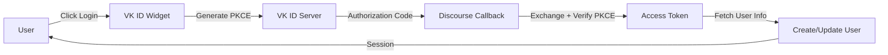

<div align="center">

# 🔐 VK ID Authentication for Discourse

[](https://www.discourse.org/)
[](https://www.ruby-lang.org/)
[](https://developer.mozilla.org/en-US/docs/Web/JavaScript)
[](https://oauth.net/2.1/)
[](LICENSE)

### 🌍 Languages / Языки

[](README.md)
[](README_RU.md)

---

**OAuth 2.1 authentication plugin with VK ID, OK.ru, and Mail.ru support**

[Features](#-features) • [Installation](#-installation) • [Configuration](#-configuration) • [Migration](#-migration-from-old-plugin) • [Documentation](#-documentation)

</div>

---

## 🆕 What's New in Version 2.0

**Complete rewrite for VK ID (id.vk.ru)**:

| Feature | Status |
|---------|--------|
| 🔒 OAuth 2.1 with mandatory PKCE | ✅ |
| 🆔 VK ID endpoints (`id.vk.ru`) | ✅ |
| 🎨 OneTap widget (VK ID SDK) | ✅ |
| 🔄 Automatic user migration | ✅ |
| 🌐 Multi-provider (VK/OK/Mail.ru) | ✅ |
| 📱 Mobile responsive | ✅ |
| 🌙 Dark theme support | ✅ |
| 🧪 Test coverage (~150 tests) | ✅ |
| 📖 Bilingual docs (EN/RU) | ✅ |

---

## ⚡ Features

<table>
<tr>
<td width="50%">

### 🔐 Security
- **OAuth 2.1** with PKCE
- Authorization code interception protection
- Email verification via `id_token`
- No permanent token storage
- Comprehensive error handling

</td>
<td width="50%">

### 🎨 User Experience
- **OneTap widget** in login modal
- Multi-provider support:
  - 🔵 VK ID
  - 🟠 OK.ru
  - 🔵 Mail.ru
- One-click authentication
- Auto-migration from old provider

</td>
</tr>
<tr>
<td width="50%">

### 🛠️ Developer Tools
- Custom OmniAuth strategy
- Rake migration tasks
- Comprehensive test suite
- Detailed logging
- TypeScript-ready

</td>
<td width="50%">

### 📚 Documentation
- Complete setup guide
- Migration documentation
- API reference
- Troubleshooting guide
- Code examples

</td>
</tr>
</table>

---

## 📋 Requirements

| Component | Version |
|-----------|---------|
|  | 2.7.0 or higher |
|  | 2.7+ |
|  | Application registered at [id.vk.ru](https://id.vk.ru/about/business/go) |
|  | VK ID demo at [id.vk.ru](https://id.vk.ru/about/business/demo/) |

---

## 🚀 Installation

### Step 1: Install Plugin

Follow the [Install a Plugin](https://meta.discourse.org/t/install-a-plugin/19157) guide using:

```bash
cd /var/discourse
nano containers/app.yml
```

Add to `hooks.after_code`:
```yaml
- git clone https://github.com/kaktaknet/discourse-vkid-oauth.git
```
```bash
git@github.com:kaktaknet/discourse-vkid-oauth.git
```

### Step 2: Rebuild Container

```bash
cd /var/discourse
./launcher rebuild app
```

---

## ⚙️ Configuration

### 1. Create VK ID Application

1. Go to **[VK ID Console](https://id.vk.ru/about/business/go)**
2. Click **"Create Application"**
3. Choose **"Website"** platform

### 2. Configure OAuth

**Redirect URI:**
```
https://your-discourse-site.com/auth/vkid/callback
```

**Scopes:**
- ✅ `vkid.personal_info` (required)
- ✅ `email` (recommended)
- ✅ `phone` (optional)

**PKCE:** ✅ Must be enabled

### 3. Discourse Settings

Navigate to: **Admin → Settings → Login**

| Setting | Value | Description |
|---------|-------|-------------|
| `vkid_enabled` | ✅ | Enable VK ID authentication |
| `vkid_client_id` | `123456` | App ID from VK ID console |
| `vkid_client_secret` | `••••••` | Secret key from VK ID |
| `vkid_scope` | `vkid.personal_info email phone` | OAuth scopes |
| `vkid_widget_enabled` | ✅ | Enable OneTap widget |
| `vkid_widget_providers` | `vkid,ok_ru,mail_ru` | Widget providers |

---

## 🎨 OneTap Widget

<div align="center">

### Modern UI with Multi-Provider Support

| Provider | Color | Icon |
|----------|-------|------|
| VK ID | <svg width="15" height="15"><rect width="15" height="15" fill="#0077ff"/></svg> `#0077ff` | 🔵 |
| OK.ru | <svg width="15" height="15"><rect width="15" height="15" fill="#ee8208"/></svg> `#ee8208` | 🟠 |
| Mail.ru | <svg width="15" height="15"><rect width="15" height="15" fill="#005ff9"/></svg> `#005ff9` | 🔵 |

</div>

**Features:**
- ⚡ Loads asynchronously (~50KB gzipped)
- 📱 Mobile responsive design
- 🌙 Dark theme support
- 🎯 One-click authentication
- 🔄 Seamless backend integration

---

## 🔄 Migration from Old Plugin

### Automatic Migration ✨

Users are **automatically migrated** on first login:

```
User logs in with VK ID
    ↓
Plugin detects old 'vkontakte' account
    ↓
Updates to 'vkid' provider
    ↓
User logged in seamlessly ✅
```

**No manual intervention required!**

### Manual Migration (Optional)

Migrate all users at once:

```bash
cd /var/discourse
./launcher enter app
rake vkid:migrate_users
```

**See:** [MIGRATION_GUIDE.md](MIGRATION_GUIDE.md) for detailed instructions

---

## 🏗️ Architecture

<div align="center">

### OAuth 2.1 Flow with PKCE



</div>

### Technology Stack

| Layer | Technology | Purpose |
|-------|-----------|---------|
| **Frontend** |  VK ID SDK | Widget UI |
| **Backend** |  Custom Strategy | OAuth 2.1 + PKCE |
| **Auth** |  | Secure flow |
| **Data** |  | User storage |

### Files Structure

```
discourse-vk-auth/
├── 📄 plugin.rb                              # Entry point
├── 📁 lib/
│   ├── 🔐 vkid_authenticator.rb             # Main authenticator
│   ├── 🔑 omniauth/strategies/vkid.rb       # OAuth 2.1 + PKCE
│   └── 🛠️ tasks/vkid_migration.rake         # Migration utilities
├── 📁 assets/
│   ├── 🎨 javascripts/                       # VK ID widget
│   └── 💅 stylesheets/                       # Widget styles
├── 📁 config/
│   ├── ⚙️ settings.yml                       # Plugin settings
│   └── 🌐 locales/                           # i18n (en, ru)
├── 🧪 spec/                                  # Test suite (~150 tests)
├── 📖 README.md                              # This file
├── 📖 README_RU.md                           # Russian docs
├── 📖 MIGRATION_GUIDE.md                     # Migration guide
└── 📖 MIGRATION_GUIDE_RU.md                  # Russian migration
```

---

## 🧪 Testing

Run the test suite:

```bash
bundle exec rspec
```

**Coverage:**
- ✅ PKCE generation and validation
- ✅ User migration scenarios
- ✅ Username uniqueness
- ✅ Error handling
- ✅ ID Token parsing
- ✅ OAuth flow integration

**Total:** ~150 test cases

---

## 🐛 Troubleshooting

<details>
<summary><b>❌ "invalid_request: code_verifier is missing"</b></summary>

**Cause:** PKCE not properly implemented or disabled.

**Solution:** Ensure you're using plugin v2.0+. PKCE is handled automatically by the custom strategy.
</details>

<details>
<summary><b>❌ "No email returned from VK ID"</b></summary>

**Cause:** Email scope not granted or user hasn't provided email.

**Solution:**
- Check `vkid_scope` includes `email`
- Verify VK ID app has email permission enabled
- User must have email in their VK account
</details>

<details>
<summary><b>❌ "redirect_uri_mismatch"</b></summary>

**Cause:** Redirect URI doesn't match VK app settings.

**Solution:** Verify redirect URI in VK ID console:
```
https://your-site.com/auth/vkid/callback
```
</details>

<details>
<summary><b>❌ Widget not showing</b></summary>

**Checks:**
1. `vkid_enabled` is true
2. `vkid_widget_enabled` is true
3. `vkid_client_id` is configured
4. Browser console for errors

**Debug:**
```javascript
console.log(window.VKIDSDK); // Should show SDK
console.log(Discourse.SiteSettings.vkid_enabled); // true
```
</details>

**See:** Full troubleshooting guide in [README.md](#troubleshooting)

---

## 📚 Documentation

| Document | Description |
|----------|-------------|
| 📖 [README.md](README.md) | Main documentation (English) |
| 📖 [README_RU.md](README_RU.md) | Документация (Русский) |
| 📖 [MIGRATION_GUIDE.md](MIGRATION_GUIDE.md) | Migration from v1.x |
| 📖 [MIGRATION_GUIDE_RU.md](MIGRATION_GUIDE_RU.md) | Руководство по миграции |

---

## 🔗 API Endpoints

| Endpoint | Purpose |
|----------|---------|
| `https://id.vk.ru/authorize` | OAuth authorization |
| `https://id.vk.ru/oauth2/auth` | Token exchange |
| `https://id.vk.ru/oauth2/user_info` | User information |

---

## 🤝 Support

- **Forum:** [Discourse Meta](https://meta.discourse.org/t/vk-com-login-vkontakte/12987)
- **Issues:** [GitHub Issues](https://github.com/kaktaknet/discourse-vk-auth/issues)
- **VK ID Docs:** [Official Documentation](https://id.vk.ru/about/business/go/docs/en/vkid/latest/oauth-vk)
- **VK ID DEMO:** [Official DEMO](https://id.vk.ru/about/business/go/demo)

---

## 📄 License

MIT License - see [LICENSE](LICENSE) file for details

---

## 🎉 Changelog

### Version 2.0.0 (2025)

#### ✨ New Features
- ✅ OAuth 2.1 with mandatory PKCE
- ✅ Custom OmniAuth strategy
- ✅ VK ID SDK widget integration
- ✅ Multi-provider support (VK/OK/Mail.ru)
- ✅ Automatic user migration
- ✅ Bilingual documentation

#### 🔧 Technical
- ✅ New endpoints (`id.vk.ru`)
- ✅ PKCE implementation (RFC 7636)
- ✅ ID Token parsing
- ✅ Enhanced security
- ✅ Comprehensive tests

#### 📖 Documentation
- ✅ Complete rewrite
- ✅ Migration guides
- ✅ Widget documentation
- ✅ Troubleshooting

### Version 1.x (Legacy - Deprecated)

- ⚠️ Old VK OAuth 2.0 (`oauth.vk.com`)
- ⚠️ No PKCE support
- ⚠️ No longer compatible

---

<div align="center">
**Made with ❤️ for Discourse community**

[⬆ Back to top](#-vk-id-authentication-for-discourse)
</div>
