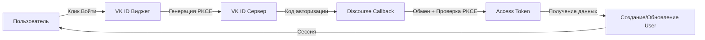

<div align="center">

# 🔐 VK ID аутентификация для Discourse

[](https://www.discourse.org/)
[](https://www.ruby-lang.org/)
[](https://developer.mozilla.org/ru/docs/Web/JavaScript)
[](https://oauth.net/2.1/)
[](LICENSE)

### 🌍 Languages / Языки

[](README.md)
[](README_RU.md)

---

**OAuth 2.1 плагин аутентификации с поддержкой VK ID, OK.ru и Mail.ru**

[Возможности](#-возможности) • [Установка](#-установка) • [Настройка](#️-настройка) • [Миграция](#-миграция-со-старого-плагина) • [Документация](#-документация)

</div>

---

## 🆕 Что нового в версии 2.0

**Полная переработка для VK ID (id.vk.ru)**:

| Функция | Статус |
|---------|--------|
| 🔒 OAuth 2.1 с обязательным PKCE | ✅ |
| 🆔 Эндпоинты VK ID (`id.vk.ru`) | ✅ |
| 🎨 OneTap виджет (VK ID SDK) | ✅ |
| 🔄 Автоматическая миграция пользователей | ✅ |
| 🌐 Мульти-провайдер (VK/OK/Mail.ru) | ✅ |
| 📱 Адаптивный дизайн | ✅ |
| 🌙 Поддержка тёмной темы | ✅ |
| 🧪 Покрытие тестами (~150 тестов) | ✅ |
| 📖 Документация (EN/RU) | ✅ |

---

## ⚡ Возможности

<table>
<tr>
<td width="50%">

### 🔐 Безопасность
- **OAuth 2.1** с PKCE
- Защита от перехвата кода авторизации
- Верификация email через `id_token`
- Токены не хранятся постоянно
- Комплексная обработка ошибок

</td>
<td width="50%">

### 🎨 Пользовательский опыт
- **OneTap виджет** в окне входа
- Поддержка множества провайдеров:
  - 🔵 VK ID
  - 🟠 OK.ru
  - 🔵 Mail.ru
- Авторизация в один клик
- Авто-миграция со старого провайдера

</td>
</tr>
<tr>
<td width="50%">

### 🛠️ Инструменты разработчика
- Собственная OmniAuth стратегия
- Rake задачи для миграции
- Комплексный набор тестов
- Детальное логирование
- Готов к TypeScript

</td>
<td width="50%">

### 📚 Документация
- Полное руководство по установке
- Документация по миграции
- Справка по API
- Руководство по устранению проблем
- Примеры кода

</td>
</tr>
</table>

---

## 📋 Требования

| Компонент | Версия |
|-----------|--------|
|  | 2.7.0 или выше |
|  | 2.7+ |
|  | Приложение зарегистрировать на [id.vk.ru](https://id.vk.ru/about/business/go) |
|  | Посмотреть демо на [id.vk.ru](https://id.vk.ru/about/business/demo/) |
---

## 🚀 Установка

### Шаг 1: Установка плагина

Следуйте инструкции [Установка плагина](https://meta.discourse.org/t/install-a-plugin/19157):

```bash
cd /var/discourse
nano containers/app.yml
```

Добавьте в `hooks.after_code`:
```yaml
- git clone https://github.com/kaktaknet/discourse-vkid-oauth.git
```
```bash
git@github.com:kaktaknet/discourse-vkid-oauth.git
```

### Шаг 2: Пересборка контейнера

```bash
cd /var/discourse
./launcher rebuild app
```

---

## ⚙️ Настройка

### 1. Создание приложения VK ID

1. Перейдите в **[Консоль VK ID](https://id.vk.ru/about/business/go)**
2. Нажмите **"Создать приложение"**
3. Выберите платформу **"Веб-сайт"**

### 2. Настройка OAuth

**Redirect URI:**
```
https://ваш-сайт-discourse.com/auth/vkid/callback
```

**Скоупы:**
- ✅ `vkid.personal_info` (обязательно)
- ✅ `email` (рекомендуется)
- ✅ `phone` (опционально)

**PKCE:** ✅ Должен быть включён

### 3. Настройки Discourse

Перейдите в: **Админ → Настройки → Вход**

| Настройка | Значение | Описание |
|-----------|----------|----------|
| `vkid_enabled` | ✅ | Включить VK ID аутентификацию |
| `vkid_client_id` | `123456` | ID приложения из консоли VK ID |
| `vkid_client_secret` | `••••••` | Секретный ключ из VK ID |
| `vkid_scope` | `vkid.personal_info email phone` | OAuth скоупы |
| `vkid_widget_enabled` | ✅ | Включить OneTap виджет |
| `vkid_widget_providers` | `vkid,ok_ru,mail_ru` | Провайдеры виджета |

---

## 🎨 OneTap виджет

<div align="center">

### Современный UI с поддержкой нескольких провайдеров

| Провайдер | Цвет | Иконка |
|-----------|------|--------|
| VK ID | <svg width="15" height="15"><rect width="15" height="15" fill="#0077ff"/></svg> `#0077ff` | 🔵 |
| OK.ru | <svg width="15" height="15"><rect width="15" height="15" fill="#ee8208"/></svg> `#ee8208` | 🟠 |
| Mail.ru | <svg width="15" height="15"><rect width="15" height="15" fill="#005ff9"/></svg> `#005ff9` | 🔵 |

</div>

**Особенности:**
- ⚡ Асинхронная загрузка (~50KB gzip)
- 📱 Адаптивный дизайн
- 🌙 Поддержка тёмной темы
- 🎯 Авторизация в один клик
- 🔄 Бесшовная интеграция с backend

---

## 🔄 Миграция со старого плагина

### Автоматическая миграция ✨

Пользователи **автоматически мигрируют** при первом входе:

```
Пользователь входит через VK ID
    ↓
Плагин находит старый аккаунт 'vkontakte'
    ↓
Обновляет на провайдер 'vkid'
    ↓
Пользователь залогинен ✅
```

**Никаких действий вручную не требуется!**

### Ручная миграция (опционально)

Мигрировать всех пользователей сразу:

```bash
cd /var/discourse
./launcher enter app
rake vkid:migrate_users
```

**См.:** [MIGRATION_GUIDE_RU.md](MIGRATION_GUIDE_RU.md) для детальных инструкций

---

## 🏗️ Архитектура

<div align="center">

### OAuth 2.1 процесс с PKCE



</div>

### Стек технологий

| Уровень | Технология | Назначение |
|---------|-----------|-----------|
| **Frontend** |  VK ID SDK | UI виджета |
| **Backend** |  Custom Strategy | OAuth 2.1 + PKCE |
| **Auth** |  | Безопасный flow |
| **Data** |  | Хранение пользователей |

### Структура файлов

```
discourse-vk-auth/
├── 📄 plugin.rb                              # Точка входа
├── 📁 lib/
│   ├── 🔐 vkid_authenticator.rb             # Основной аутентификатор
│   ├── 🔑 omniauth/strategies/vkid.rb       # OAuth 2.1 + PKCE
│   └── 🛠️ tasks/vkid_migration.rake         # Утилиты миграции
├── 📁 assets/
│   ├── 🎨 javascripts/                       # VK ID виджет
│   └── 💅 stylesheets/                       # Стили виджета
├── 📁 config/
│   ├── ⚙️ settings.yml                       # Настройки плагина
│   └── 🌐 locales/                           # i18n (en, ru)
├── 🧪 spec/                                  # Набор тестов (~150 тестов)
├── 📖 README.md                              # Документация (English)
├── 📖 README_RU.md                           # Этот файл
├── 📖 MIGRATION_GUIDE.md                     # Руководство по миграции (EN)
└── 📖 MIGRATION_GUIDE_RU.md                  # Руководство по миграции (RU)
```

---

## 🧪 Тестирование

Запуск тестов:

```bash
bundle exec rspec
```

**Покрытие:**
- ✅ Генерация и валидация PKCE
- ✅ Сценарии миграции пользователей
- ✅ Уникальность username
- ✅ Обработка ошибок
- ✅ Парсинг ID Token
- ✅ Интеграция OAuth flow

**Всего:** ~150 тест-кейсов

---

## 🐛 Устранение проблем

<details>
<summary><b>❌ "invalid_request: code_verifier is missing"</b></summary>

**Причина:** PKCE не реализован правильно или отключён.

**Решение:** Убедитесь, что используете плагин v2.0+. PKCE обрабатывается автоматически собственной стратегией.
</details>

<details>
<summary><b>❌ "Email не возвращён от VK ID"</b></summary>

**Причина:** Скоуп email не предоставлен или пользователь не указал email.

**Решение:**
- Проверьте, что `vkid_scope` включает `email`
- Убедитесь, что в приложении VK ID включено разрешение email
- У пользователя должен быть email в аккаунте VK
</details>

<details>
<summary><b>❌ "redirect_uri_mismatch"</b></summary>

**Причина:** Redirect URI не соответствует настройкам приложения VK.

**Решение:** Проверьте redirect URI в консоли VK ID:
```
https://ваш-сайт.com/auth/vkid/callback
```
</details>

<details>
<summary><b>❌ Виджет не отображается</b></summary>

**Проверки:**
1. `vkid_enabled` = true
2. `vkid_widget_enabled` = true
3. `vkid_client_id` настроен
4. Консоль браузера на наличие ошибок

**Отладка:**
```javascript
console.log(window.VKIDSDK); // Должен показать SDK
console.log(Discourse.SiteSettings.vkid_enabled); // true
```
</details>

**См.:** Полное руководство по устранению проблем в [README_RU.md](#устранение-проблем)

---

## 📚 Документация

| Документ | Описание |
|----------|----------|
| 📖 [README.md](README.md) | Основная документация (English) |
| 📖 [README_RU.md](README_RU.md) | Документация (Русский) |
| 📖 [MIGRATION_GUIDE.md](MIGRATION_GUIDE.md) | Миграция с v1.x (EN) |
| 📖 [MIGRATION_GUIDE_RU.md](MIGRATION_GUIDE_RU.md) | Руководство по миграции (RU) |

---

## 🔗 API Эндпоинты

| Эндпоинт | Назначение |
|----------|-----------|
| `https://id.vk.ru/authorize` | OAuth авторизация |
| `https://id.vk.ru/oauth2/auth` | Обмен токена |
| `https://id.vk.ru/oauth2/user_info` | Информация о пользователе |

---

## 🤝 Поддержка

- **Форум:** [Discourse Meta](https://meta.discourse.org/t/vk-com-login-vkontakte/12987)
- **Проблемы:** [GitHub Issues](https://github.com/kaktaknet/discourse-vk-auth/issues)
- **Документация VK ID:** [Официальная документация](https://id.vk.ru/about/business/go/docs/ru/vkid/latest/oauth-vk)
- **ДЕМО VK ID:** [Официальная демонстрация](https://id.vk.ru/about/business/go/demo)

---

## 📄 Лицензия

MIT License - см. файл [LICENSE](LICENSE)

---

## 🎉 История изменений

### Версия 2.0.0 (2025)

#### ✨ Новые возможности
- ✅ OAuth 2.1 с обязательным PKCE
- ✅ Собственная OmniAuth стратегия
- ✅ Интеграция VK ID SDK виджета
- ✅ Поддержка множества провайдеров (VK/OK/Mail.ru)
- ✅ Автоматическая миграция пользователей
- ✅ Двуязычная документация

#### 🔧 Технические улучшения
- ✅ Новые эндпоинты (`id.vk.ru`)
- ✅ Реализация PKCE (RFC 7636)
- ✅ Парсинг ID Token
- ✅ Улучшенная безопасность
- ✅ Комплексные тесты

#### 📖 Документация
- ✅ Полная переработка
- ✅ Руководства по миграции
- ✅ Документация виджета
- ✅ Устранение проблем

### Версия 1.x (Устаревшая)

- ⚠️ Старый VK OAuth 2.0 (`oauth.vk.com`)
- ⚠️ Без поддержки PKCE
- ⚠️ Более не совместима

---

<div align="center">
[](https://github.com/kaktaknet/discourse-vk-auth)

**Сделано с ❤️ для сообщества Discourse**

[⬆ Наверх](#-vk-id-аутентификация-для-discourse)</div>
